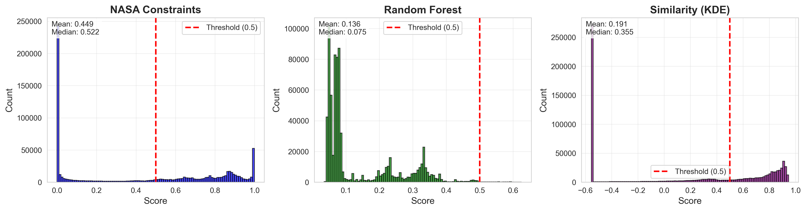
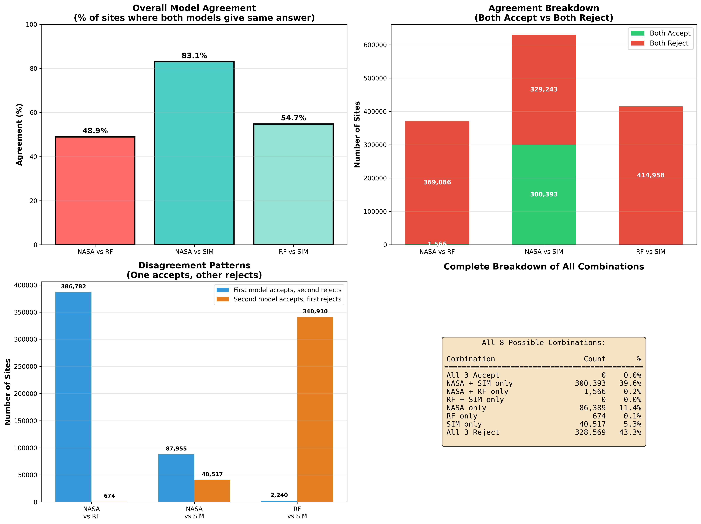
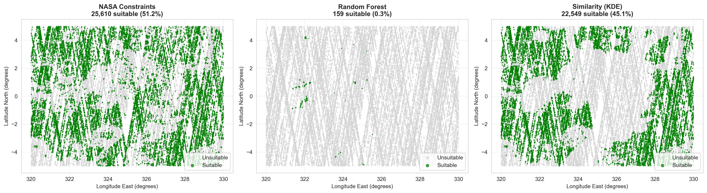
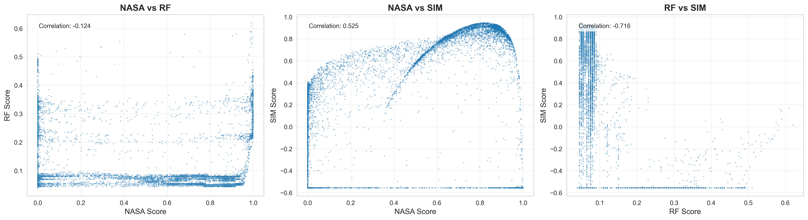
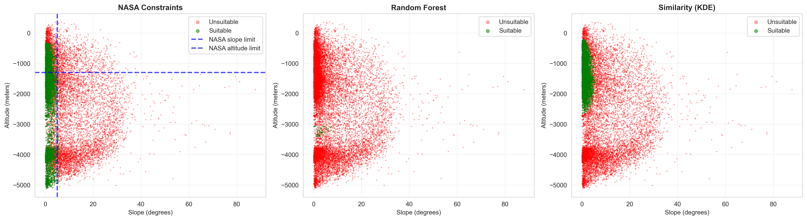

# Mars Landing Site Evaluation Results

This document presents the complete results from evaluating 758,108 candidate Mars landing sites using three complementary approaches: NASA engineering constraints, supervised machine learning, and unsupervised similarity modeling.

---

## Table of Contents

1. [Executive Summary](#executive-summary)
2. [The Three Models](#the-three-models)
3. [Results Visualizations](#results-visualizations)
   - [Score Distributions](#score-distributions)
   - [Consensus Breakdown](#consensus-breakdown)
   - [Pairwise Agreement Analysis](#pairwise-agreement-analysis)
   - [Geographic Consensus Map](#geographic-consensus-map)
   - [Individual Model Predictions](#individual-model-predictions)
   - [Score Correlations](#score-correlations)
   - [Feature Space Analysis](#feature-space-analysis-altitude-slope)
4. [Top Recommended Sites](#top-recommended-sites)
5. [Statistical Summary](#statistical-summary)
6. [Interpretation & Recommendations](#interpretation--recommendations)
7. [Technical Notes](#technical-notes)
8. [Data Files](#data-files)
9. [Conclusion](#conclusion)

---

## Executive Summary

**Region Analyzed**: 320-330°E longitude, ±5°N latitude (equatorial Mars)  
**Candidates Evaluated**: 758,108 sites  
**Training Data**: 160,777 labeled sites from 6 Mars missions  

### Key Findings

- **No perfect consensus**: 0 sites accepted by all three models
- **Recommended sites**: 301,959 sites (39.8%) accepted by majority (2 of 3 models)
- **Model agreement**: NASA and Similarity agree 83.1% of the time (highest)
- **Random Forest**: Extremely conservative (0.3% acceptance rate)

---

## The Three Models

### 1. NASA Constraints (Deterministic)
**Philosophy**: Physics-based engineering rules with soft thresholds

**Constraints**:
- Slope < 5°
- Roughness < 8m RMS  
- Altitude < -1300m

**Result**: 388,348 suitable sites (51.2%)

---

### 2. Random Forest (Supervised ML)
**Philosophy**: Learn from historical landing data with emphasis on known hazards

**Training**:
- 160,777 labeled sites (30.4% positive, 38.5% weak negative, 31.1% hard negative)
- Hard negatives weighted 2x to emphasize learning from hazards
- 200 trees, balanced class weights

**Result**: 2,240 suitable sites (0.3%) - **extremely conservative**

**Feature Importance**:
1. Altitude (42.0%)
2. Latitude (22.1%)
3. Longitude (17.7%)
4. Radius (15.3%)
5. Roughness (1.6%)
6. Slope (remaining)

---

### 3. Similarity KDE (Unsupervised ML)
**Philosophy**: Identify sites similar to successful historical landings

**Training**:
- 48,903 positive examples only (ignores negative data)
- Gaussian kernel with auto-tuned bandwidth (0.4281)
- Scores by density in 6D feature space

**Result**: 340,910 suitable sites (45.0%)

---

## Results Visualizations

### Score Distributions

**Description**: Histogram of suitability scores for each model. 
- **NASA** (blue): Bimodal distribution with peaks near 0 (unsuitable) and 1 (suitable)
- **Random Forest** (green): Heavily skewed toward low scores, maximum score only 0.625
- **Similarity KDE** (purple): Wide spread with slight negative skew

**Key Insight**: RF's maximum score of 0.625 (well below typical "confident" threshold of 0.8+) suggests the model never achieves high confidence, explaining its extreme conservatism.

---

### Consensus Breakdown

**Description**: Two views of model agreement patterns:
- **Left (Bar Chart)**: Number of models agreeing (0, 1, 2, or 3)
- **Right (Pie Chart)**: Percentage breakdown of consensus categories

**Key Findings**:
- **All Accept (3/3)**: 0 sites (0.0%) - No perfect consensus
- **Majority Accept (2/3)**: 301,959 sites (39.8%) - **Recommended for mission planning**
- **Minority Accept (1/3)**: 127,580 sites (16.8%)
- **All Reject (0/3)**: 328,569 sites (43.3%)

**Why no perfect consensus?** RF's extreme conservatism (0.3% acceptance) means even when it accepts a site, at least one other model rejects it.

---

### Pairwise Agreement Analysis

**Description**: Four-panel analysis of model pair agreements:
1. **Top Left**: Overall agreement percentages between model pairs
2. **Top Right**: Breakdown of agreements (both accept vs both reject)
3. **Bottom Left**: Disagreement patterns (who accepts when the other rejects)
4. **Bottom Right**: Complete 8-category combination table

**Key Findings**:
- **NASA vs Similarity**: 83.1% agreement (highest) - 300,393 sites both accept
- **NASA vs RF**: 48.9% agreement (lowest) - RF only accepts 1,566 sites that NASA accepts
- **RF vs Similarity**: 54.7% agreement - **RF and SIM never both accept (0 sites)**

**Critical Insight**: RF never accepts a site that Similarity rejects, meaning RF is strictly more conservative than all other models.

---

### Geographic Consensus Map

**Description**: Spatial scatter plot (sample of 50,000 sites) colored by number of models in agreement.
- **Red**: 0 models accept (all reject)
- **Yellow**: 1-2 models accept
- **Green**: 3 models accept (none exist)

**Key Observations**:
- Strong spatial clustering of consensus patterns
- Majority-accept sites (yellow/orange) form continuous regions
- Geographic features strongly influence model agreement

---

### Individual Model Predictions

**Description**: Three geographic maps showing each model's predictions separately:
- **NASA** (left): 388,348 suitable sites (51.2%) - most permissive
- **Random Forest** (center): 2,240 suitable sites (0.3%) - extremely selective
- **Similarity KDE** (right): 340,910 suitable sites (45.0%) - moderately permissive

**Key Observations**:
- NASA shows broad acceptance across the region
- RF accepts only tiny clustered areas (barely visible at this scale)
- Similarity pattern resembles NASA but slightly more restrictive

---

### Score Correlations

**Description**: Pairwise scatter plots showing correlation between model scores (sample of 10,000 sites).

**Correlation Coefficients**:
- **NASA vs RF**: Low correlation - RF compresses all scores below 0.625
- **NASA vs SIM**: Moderate positive correlation - similar scoring patterns
- **RF vs SIM**: Low correlation - fundamentally different scoring approaches

**Key Insight**: Low correlations indicate the three models use genuinely different criteria, providing complementary perspectives.

---

### Feature Space Analysis (Altitude-Slope)

**Description**: Decision boundaries in altitude-slope space for each model. Blue dashed lines on NASA panel show constraint thresholds.

**Key Observations**:
- **NASA**: Clear decision boundary at slope=5° and altitude=-1300m (logistic smoothing visible)
- **Random Forest**: Extremely restrictive region - accepts only low slope AND very deep altitude (-3100m to -3230m)
- **Similarity**: More diffuse acceptance region following distribution of training positives

**Why is RF so conservative?** The feature space plot reveals RF learned to trust only sites with altitudes 2000m deeper than NASA's limit, suggesting overfitting to the specific geography of training missions.

---

## Top Recommended Sites

### Majority Consensus Sites (2/3 Models Accept)

**Top 3 Sites** (by average score across all models):

| Rank | Longitude (°E) | Latitude (°N) | Altitude (m) | Slope (°) | Roughness (m) | NASA | RF | SIM | Avg |
|------|----------------|---------------|--------------|-----------|---------------|------|-----|-----|-----|
| 1 | 323.058 | -1.417 | -1716 | 0.37 | 1.44 | 0.886 | 0.075 | 0.909 | 0.624 |
| 2 | 323.051 | -1.416 | -1714 | 0.37 | 1.44 | 0.886 | 0.075 | 0.910 | 0.624 |
| 3 | 323.052 | -1.421 | -1714 | 0.31 | 1.10 | 0.886 | 0.075 | 0.909 | 0.623 |

**Characteristics of Recommended Sites**:
- Altitude: -1670m to -1720m (well within NASA limits)
- Slope: 0.1-0.6° (extremely flat)
- Roughness: 0.9-1.5m RMS (very smooth)
- Location: Clustered around 323°E, -1.4°N and 322.9°E, 0.06°N

---

## Statistical Summary

### Model Performance

| Model | Suitable Sites | % Suitable | Mean Score | Median Score |
|-------|----------------|------------|------------|--------------|
| NASA Constraints | 388,348 | 51.2% | 0.449 | 0.522 |
| Random Forest | 2,240 | 0.3% | 0.136 | 0.075 |
| Similarity KDE | 340,910 | 45.0% | 0.191 | 0.355 |

### Agreement Statistics

| Model Pair | Agreement % | Both Accept | Both Reject |
|------------|-------------|-------------|-------------|
| NASA vs Similarity | 83.1% | 300,393 | 329,243 |
| RF vs Similarity | 54.7% | 0 | 414,958 |
| NASA vs RF | 48.9% | 1,566 | 369,086 |

---

## Interpretation & Recommendations

### Why Three Models?

Each model provides a unique perspective:

1. **NASA Constraints**: Fast, interpretable, based on proven engineering principles
2. **Random Forest**: Data-driven safety emphasis, learns from known hazards
3. **Similarity KDE**: Pattern recognition without negative bias, finds familiar terrain

### Recommended Approach

**For validated, safe landing sites**: Use **majority consensus (2/3 models)** = **301,959 sites**
- Balances safety (two independent approvals) with practicality
- Primarily NASA + Similarity agreement (since RF rarely accepts)
- Provides sufficient site options for mission planning

**For maximum safety (conservative)**: Use **RF-accepted sites only** = **2,240 sites**
- Extremely cautious selection
- May be overly restrictive due to overfitting
- Warrants further investigation of why RF is so selective

**For exploratory missions (higher risk tolerance)**: Use **NASA OR Similarity** = ~430,000 sites
- Broader site options
- At least one model validation
- Suitable for early reconnaissance

---

## Technical Notes

### Random Forest Conservatism Analysis

The RF model's 0.3% acceptance rate is unexpectedly low. Possible explanations:

1. **Overfitting to training geography**: 82% of feature importance from altitude + latitude + longitude suggests learning location-specific patterns rather than generalizable terrain features
2. **Hard negative weighting**: 2x weight on hard negatives may have created excessive caution
3. **Perfect training accuracy**: 100% training accuracy indicates potential overfitting
4. **Maximum score limitation**: No site scores above 0.625, suggesting model never achieves confidence

**Recommendation**: Consider retraining RF with:
- Reduced hard negative weight (1.5x instead of 2x)
- Max depth limitation for regularization
- Geographic features removed or downweighted
- Alternative validation on independent test regions

---

## Data Files

All results are available in `modeling/output/`:

- **Models**: `output/models/` (trained model files)
- **Results**: `output/results/candidate_evaluations.csv` (101 MB, all 758K sites scored)
- **Top Sites**: `output/results/top_sites_majority_consensus.csv` (top 20 recommended)
- **RF Sites**: `output/results/all_rf_accepted_sites.csv` (all 2,240 RF-accepted sites)
- **Plots**: `output/plots/` (all 7 visualization figures)

---

## Conclusion

This three-model evaluation system successfully identified **301,959 candidate Mars landing sites** with majority consensus (2 of 3 models agree) in the equatorial region. The approach demonstrates that combining deterministic constraints, supervised learning, and unsupervised similarity provides complementary perspectives on landing site safety.

The Random Forest model's extreme conservatism (0.3% acceptance) highlights the importance of model diversity - while potentially overfitted to training geography, it serves as a valuable "second opinion" that can flag sites requiring additional scrutiny.

**Next Steps**:
1. Validate recommended sites against additional criteria (dust storm patterns, communication coverage, science objectives)
2. Investigate RF-accepted sites to understand what makes them "extra safe"
3. Retrain RF with adjusted hyperparameters to reduce overfitting
4. Expand analysis to other Mars regions beyond 320-330°E
